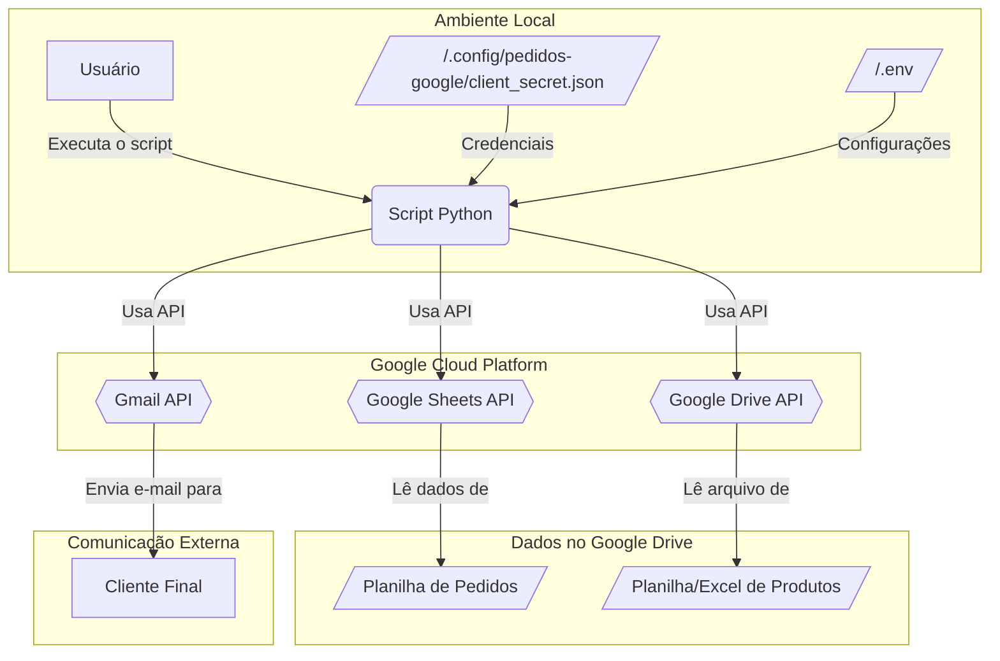
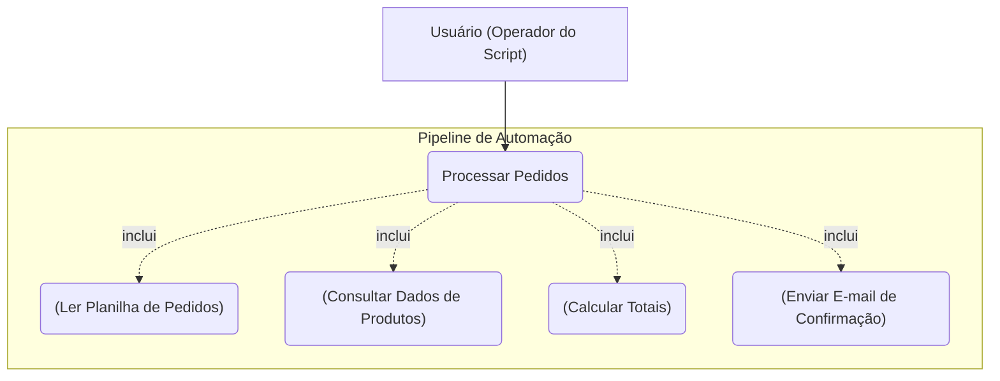
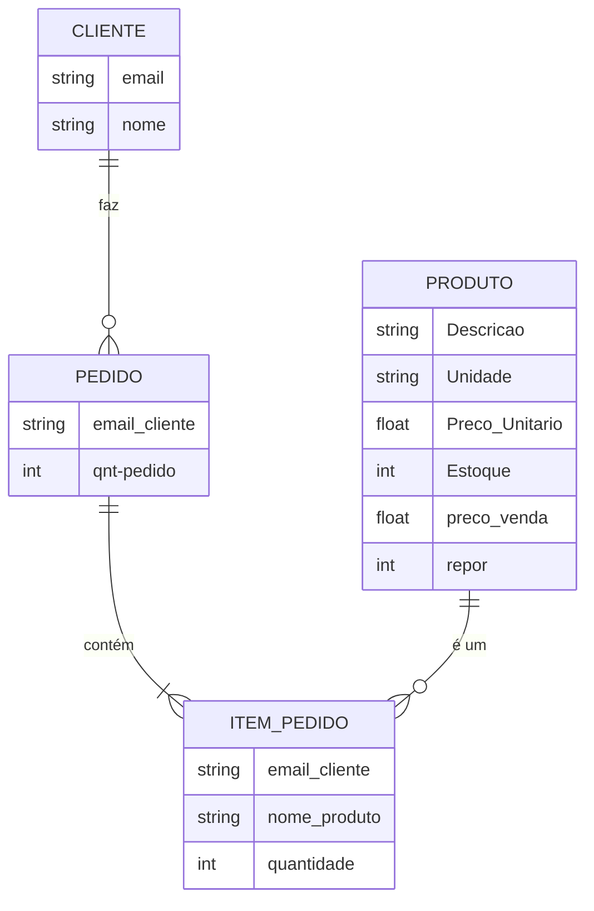
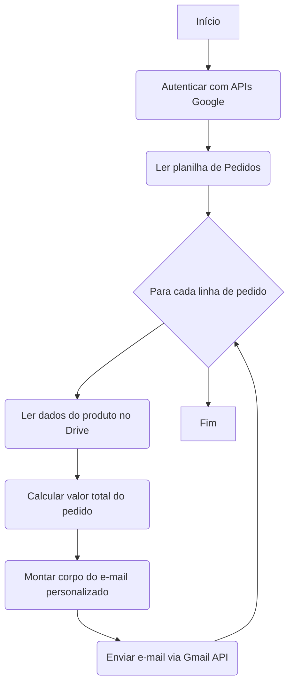

# 🚀 Pipeline de Automação de Pedidos com Google APIs

Este projeto automatiza o fluxo de processamento de pedidos utilizando as APIs do Google. Ele lê os pedidos de uma planilha do Google Sheets, busca informações de produtos em outra planilha (ou arquivo Excel) no Google Drive, calcula os totais e envia e-mails de confirmação personalizados via Gmail.

### Arquitetura da Solução

O diagrama abaixo ilustra os principais componentes e o fluxo de dados da automação.



## ✨ Funcionalidades

- **Leitura de Pedidos:** Extrai dados de pedidos diretamente de uma planilha do Google Sheets.
- **Consulta de Produtos:** Lê a tabela de produtos, que pode ser tanto um Google Sheet quanto um arquivo Excel (`.xlsx`) armazenado no Google Drive.
- **Cálculo de Totais:** Processa os pedidos e calcula o valor total a ser cobrado de cada cliente.
- **Envio de E-mails:** Envia e-mails de confirmação personalizados para cada cliente através da API do Gmail.
- **Segurança:** Armazena os tokens de autenticação OAuth de forma segura no diretório `~/.config/pedidos-google/`.

### Casos de Uso



## 📋 Requisitos

- Python 3.8+
- Uma Conta Google
- Um projeto configurado no Google Cloud Platform
- As bibliotecas Python listadas no arquivo `requirements.txt`

## ⚙️ Guia de Configuração Completo

Para que o script funcione, são necessárias duas etapas de configuração: preparar as APIs no Google Cloud e configurar o seu ambiente local.

### Parte A: Configuração do Projeto no Google Cloud

Siga estes passos para obter as credenciais de acesso às APIs.

1.  **Crie um Projeto no Google Cloud**
    * Acesse o [Google Cloud Console](https://console.cloud.google.com/).
    * No menu superior, clique no seletor de projetos e selecione **"NOVO PROJETO"**.
    * Dê um nome ao projeto (ex: `Automacao-Pedidos`) e clique em **"CRIAR"**.

2.  **Ative as APIs Necessárias**
    * Com o novo projeto selecionado, vá para o menu de navegação **APIs e serviços > Biblioteca**.
    * Pesquise e ative as três APIs a seguir, uma de cada vez:
        * `Google Sheets API`
        * `Google Drive API`
        * `Gmail API`

3.  **Configure a Tela de Consentimento OAuth**
    * No menu, acesse **APIs e serviços > Tela de consentimento OAuth**.
    * Selecione o tipo de usuário **"Externo"** e clique em **"CRIAR"**.
    * Preencha as informações obrigatórias:
        * **Nome do app:** Um nome de sua preferência (ex: "App de Pedidos").
        * **E-mail para suporte do usuário:** Seu e-mail de contato.
        * **Dados de contato do desenvolvedor:** Seu e-mail novamente.
    * Salve e continue nas próximas etapas.

4.  **Crie as Credenciais**
    * No menu, vá para **APIs e serviços > Credenciais**.
    * Clique em **"+ CRIAR CREDENCIAIS"** e selecione **"ID do cliente OAuth"**.
    * Em **"Tipo de aplicativo"**, escolha **"App para computador"**.
    * Dê um nome (ex: "Credenciais Desktop") e clique em **"CRIAR"**.

5.  **Faça o Download do JSON e Adicione Usuários de Teste**
    * Após a criação, uma janela aparecerá. Clique em **"FAZER O DOWNLOAD DO JSON"**.
    * **‼️ IMPORTANTE:** Renomeie o arquivo baixado para `client_secret.json`.
    * Volte para a **Tela de permissões OAuth > Público-alvo** e, na seção **"Usuários de teste"**, adicione a Conta Google que você usará para executar o script.

```mermaid
graph TD
    subgraph Criação do Projeto
        A[Acessar o Google Cloud Console] --> B[Clique no seletor de projetos];
        B --> C[Clicar em 'NOVO PROJETO'];
        C --> D[Nomear o projeto, ex: Automacao-Pedidos];
        D --> E[Clicar em 'CRIAR'];
    end

    subgraph Configuração de APIs
        E --> F[No projeto criado, ir para 'APIs e serviços > Biblioteca'];
        F --> G[Pesquisar e ativar 'Google Sheets API'];
        G --> H[Pesquisar e ativar 'Google Drive API'];
        H --> I[Pesquisar e ativar 'Gmail API'];
    end

    subgraph Tela de Consentimento OAuth
        I --> J[Acessar 'APIs e serviços > Tela de consentimento OAuth'];
        J --> K[Selecionar tipo de usuário 'Externo' e 'CRIAR'];
        K --> L[Preencher informações obrigatórias: Nome do app, E-mail de suporte, Contato do desenvolvedor];
        L --> M[Salvar e continuar];
    end

    subgraph Criação e Gestão de Credenciais
        M --> N[Acessar 'APIs e serviços > Credenciais'];
        N --> O[Clicar em '+ CRIAR CREDENCIAIS'];
        O --> P[Selecionar 'ID do cliente OAuth'];
        P --> Q[Escolher 'App para computador' como Tipo de aplicativo];
        Q --> R[Dar um nome e clicar em 'CRIAR'];
        R --> S[Fazer o download do arquivo JSON];
        S --> T[Renomear arquivo para 'client_secret.json'];
        T --> U[Voltar à 'Tela de permissões OAuth > Público-alvo' e adicionar Usuários de teste];
        U --> V[Fim do Processo];
    end
```



### Parte B: Planilhas para consulta

O script realiza a consulta em duas planilhas, uma de pedidos e outra de produtos

1. **A planilha de pedidos**

    A planilha de pedido é onde fica registrado a quantidade de cada produto que o cliente solicitou, a ordem dos produtos nas colunas deve ser igual ordem dos produtos nas linhas da planilha de produtos, estrutura da planilha:

| Endereço de e-mail | Produto 1 | Produto 2 |
|-------------|-------------|-------------|
| E-mail cliente 1 | Quantidade | Quantidade |
| E-mail cliente 2 | Quantidade | Quantidade |
| E-mail cliente 3 | Quantidade | Quantidade |

2. **A planilha de produtos**

    Esta planilha deve conter as informações de todos os produtos disponiveis, estrutura da planilha:

| Descricão | Unidade | Preco Unitário | Quantidade em Estoque | Preco de Venda | Repor |
|-------------|-------------|-------------|-------------|-------------|-------------|
| Produto 1 | CX | 10,0 | 10 | 15,50 | 0 |
| Produto 2 | CX | 20,0 | 10 | 18,50 | 0 |

Ambas as planilhas devem estar no google drive da conta logada.

### Modelo de Dados Conceitual

O relacionamento entre os dados contidos nessas planilhas pode ser representado pelo seguinte modelo:



### Parte C: Configuração do Ambiente Local

Agora, prepare sua máquina para executar o script.

1.  **Clone o Repositório**
    ```bash
    git clone <URL_DO_REPOSITORIO>
    cd <NOME_DO_SEU_REPOSITORIO>
    ```

2.  **Crie um Ambiente Virtual no Anaconda**
    ```bash
    conda create --name nome_do_ambiente python=versão_do_python
    ```

3.  **Ativando o ambiente**
    ```bash
    conda activate nome_do_ambiente
    ```

4.  **Instale as Dependências**
    ```bash
    pip install -r requirements.txt
    ```

5.  **Posicione o Arquivo de Credenciais**
    * Mova o arquivo `client_secret.json` que você baixou para o diretório de configuração.
    ```bash
    # Cria o diretório se ele não existir
    mkdir -p ~/.config/pedidos-google/

    # Mova o arquivo (ajuste o caminho se necessário)
    mv ~/Downloads/client_secret.json ~/.config/pedidos-google/
    ```

6.  **Crie o Arquivo de Variáveis de Ambiente (`.env`)**
    * Na raiz do seu projeto, crie um arquivo chamado `.env`.
    * Copie o conteúdo do exemplo abaixo e preencha com suas informações.

    *Exemplo de `.env`:*
    ```env
    # ID da planilha do Google Sheets que contém os pedidos.
    # Ex: "1a2b3c4d..." da URL da sua planilha.
    SHEETS_PEDIDOS_ID="SEU_ID_DA_PLANILHA_DE_PEDIDOS"

    # (Opcional) Range da planilha de pedidos. Padrão: "A:Z"
    SHEETS_PEDIDOS_RANGE="Pagina1!A:Z"

    # (Opcional) ID da pasta no Google Drive onde o arquivo de produtos está.
    DRIVE_PRODUTOS_FOLDER_ID="SEU_ID_DA_PASTA_NO_DRIVE"

    # Nome do arquivo de produtos no seu drive (pode ser .xlsx ou Google Sheet).
    # Se deixado em branco, busca uma aba "Produtos" na mesma planilha dos pedidos.
    PRODUTOS_FILENAME="Tabela de Produtos.xlsx"

    # E-mail que será usado para enviar as confirmações.
    SENDER_EMAIL="seu-email@gmail.com"

    # Informativo para adicionar +cliente no e-mail enviado
    USE_PLUS_ADDRESSING=true    
    ```

## ▶️ Como Executar o Script

Antes de executar, é útil entender o fluxo de trabalho que o script seguirá. O diagrama de atividades abaixo descreve o processo completo.

### Fluxo de Execução do Script



1.  **Instale o Jupyter Notebook**
    ```bash
    conda install jupyter notebook
    ```

2.  **Inicie o Jupyter Notebook**
    ```bash
    jupyter notebook
    ```

3.  **Por fim, navegue até o diretório clonado e execute o script**
  

